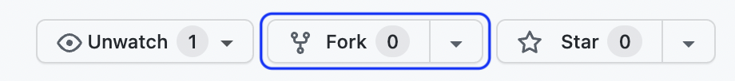

# Calculator App

## About

This is an assessment for Unifai (https://www.unifai.us/).

Working buttons currently include: 
- all numbers 0-9
- decimal "."
- equal "="

Working functions currently include: 
- add "+"
- subtract "–" 
- multiply "×"
- divide "÷"
- clear ("AC")

## Dev Environment

I am using `parcel` for quick set up and the React framework (`react` & `react-dom`) for building the app.

# Getting Started

## Fork this GitHub repository to your own account.

https://github.com/yoyoyojoe/calculator



## Git Clone 

Run the following command in your terminal to clone this repo into your local environment & preferred directory.

```
git clone https://github.com/yoyoyojoe/calculator.git
```

## Install all dependencies

Make sure you're within the root directory `calculator` (run `cd calculator`) in your terminal, run the following commands to get started.

```
npm install
```

## Start application 

### in development mode

Start the application in development mode. 

```
npm start
```
Parcel’s builtin dev server is automatically started when you run the default `parcel` command, which is a shortcut for `parcel serve`. By default, it starts a server at http://localhost:1234. If port 1234 is already in use, then a fallback port will be used. After Parcel starts, the location where the dev server is listening will be printed to the terminal.

### in production mode

Optionally, you can build the application for production. We will also remove all files within `dist` first.

```
npm run build
```

Then start application the same way (but now in production mode).

```
npm start
```

Generally speaking, building production code for your project has many benefits ([here](https://parceljs.org/features/production/) for more details), but for this project it should not make much, if any, difference between the development build and the production build.

After you build the application, if you want to go back to development mode, delete all files in your `dist` folder to run your application in development mode again with `npm start`. If the files (specifically `dist/index.html`) are/is not deleted, `parcel` will still use the same cached `index.html` file that references the same cached production-ready JavaScript files in `dist` and run in production mode even if you want to run the app in development mode.

# Notes

Stumbled upon `math.js` (https://mathjs.org/) and would be super cool to implement for future iterations or other projects.

Definitely more functions and features can be done to make this calculator even better!